# MyBatis

## MyBatis介绍

- [MyBatis中文手册](https://mybatis.net.cn)
- [Maven仓库](https://mvnrepository.com)

1. 传统方式Java程序操作DB
   - Java程序：连接数据库/连接池；编写SQL语句；发送SQL，完成crud
   - 问题：要自己连接数据库，即代码由程序员编写，不一定标准；程序不是通过OOP的方式来操作；
     SQL语句是写在程序中，属于硬编码，没有解耦
   - 
2. MyBatis是一个持久层框架，前身是ibatis，在ibatis3.x时，更名为MyBatis
   - MyBatis在java和sql之间提供了更灵活的映射方案
   - MyBatis可以将对数据库表的操作(sql)等等直接剥离，写到xml配置文件，实现和java代码的解耦
   - MyBatis通过SQL操作DB，建库建表的工作需要程序员完成
   - 

## 快速入门

> 要求：开发一个MyBatis项目，通过MyBatis方法完成对monster表的crud操作

### 代码实现

1. 创建mybatis数据库、monster表

```mysql
-- 创建mybatis数据库
create database if not exists `mybatis`;
use `mybatis`;
-- 创建monster表
create table `monster`
(
    `id` int not null auto_increment,
   `age` int not null,
   `birthday` date default null,
   `email` varchar(255) not null,
   `gender` tinyint not null,
   `name` varchar(255) not null,
   `salary` double not null,
   primary key (`id`)
)charset=utf8;
```

|  |  |  |  |
|-------------------------|-------------------------|-------------------------|-------------------------|

```xml
<?xml version="1.0" encoding="UTF-8"?>
<project xmlns="http://maven.apache.org/POM/4.0.0"
         xmlns:xsi="http://www.w3.org/2001/XMLSchema-instance"
         xsi:schemaLocation="http://maven.apache.org/POM/4.0.0 http://maven.apache.org/xsd/maven-4.0.0.xsd">
    <modelVersion>4.0.0</modelVersion>

    <!--
    1. 将mybatis作为父项目管理多个子模块/子项目
    2. 父项目的完整坐标 groupId[阻止名]+artifactId[项目名]
    3. 该父项目会管理多个子模块，将来父项目中引入的依赖可以直接给子项目使用，这样开发简单，提高复用性且便于管理
    4. <packaging>pom</packaging> 表示父项目以多个子模块/子项目管理工程
    -->
    <groupId>com.charlie</groupId>
    <artifactId>mybatis</artifactId>
    <version>1.0-SNAPSHOT</version>
    <packaging>pom</packaging>
    <!--在modules指定管理哪些子模块-->
    <modules>
        <module>mybatis_quickstart</module>
    </modules>

    <!--加入依赖-->
    <dependencies>
        <!--mysql依赖-->
        <dependency>
            <groupId>mysql</groupId>
            <artifactId>mysql-connector-java</artifactId>
            <version>5.1.49</version>
        </dependency>
        <!--mybatis依赖-->
        <dependency>
            <groupId>org.mybatis</groupId>
            <artifactId>mybatis</artifactId>
            <version>3.5.7</version>
        </dependency>
        <!--junit依赖-->
        <dependency>
            <groupId>junit</groupId>
            <artifactId>junit</artifactId>
            <version>4.12</version>
            <!--scope表示该jar包的作用范围在test目录下-->
            <scope>test</scope>
        </dependency>
    </dependencies>

    <!--在build中配置resources，来防止资源导出失败的问题
    1. 不同的idea/maven，可能提示的错误不一样
    2. 不变应万变，少什么文件，就增加响应配置即可
    3. 含义是将 src/main/java 目录和子目录 以及 src/main/resources 目录和子目录下的资源文件(xml文件)
            在build项目时，导出到对应的target目录下
    -->
    <build>
        <resources>
            <resource>
                <directory>src/main/java</directory>
                <includes>
                    <include>**/*.xml</include>
                </includes>
            </resource>
            <resource>
                <directory>src/main/resources</directory>
                <includes>
                    <include>**/*.xml</include>
                    <include>**/*.properties</include>
                </includes>
            </resource>
        </resources>
    </build>

    <properties>
        <maven.compiler.source>8</maven.compiler.source>
        <maven.compiler.target>8</maven.compiler.target>
        <project.build.sourceEncoding>UTF-8</project.build.sourceEncoding>
    </properties>
</project>
```

2. 在`resources`目录下创建`mybatis-config.xml`配置文件

```xml
<?xml version="1.0" encoding="UTF-8" ?>
<!DOCTYPE configuration
        PUBLIC "-//mybatis.org//DTD Config 3.0//EN"
        "http://mybatis.org/dtd/mybatis-3-config.dtd">
<configuration>

    <!--配置MyBatis自带的日志输出，可以查看原生的sql，该配置应放在最前面-->
    <settings>
        <setting name="logImpl" value="STDOUT_LOGGING"/>
    </settings>

    <!--配置别名，降低冗余的全限定类名书写-->
    <typeAliases>
        <typeAlias alias="Monster" type="com.charlie.entity.Monster"/>
    </typeAliases>

    <environments default="development">
        <environment id="development">
            <!--配置事务管理器-->
            <transactionManager type="JDBC"/>
            <!--配置数据源-->
            <dataSource type="POOLED">
                <!--配置驱动-->
                <property name="driver" value="com.mysql.jdbc.Driver"/>
                <!--配置连接mysql的url
                1. jdbc:mysql 连接协议
                2. 127.0.0.1:3306：指定连接mysql的ip+port
                3. mybatis：连接的DB
                4. useSSL=true：表示使用安全连接
                5. &amp;表示&符号，用于连接参数，防止解析错误
                6. useUnicode=true：使用unicode，防止编码错误
                7. characterEncoding=UTF-8：指定使用utf-8，防止中文乱码
                8. 不需要记忆，理解即可
                -->
                <property name="url" value="jdbc:mysql://127.0.0.1:3306/mybatis?useSSL=true&amp;useUnicode=true&amp;characterEncoding=UTF-8"/>
                <property name="username" value="root"/>
                <property name="password" value="hsp"/>
            </dataSource>
        </environment>
    </environments>
    <!--
    1. 这里配置需要关联的Mapper.xml
    2. 这里可以通过copy path from source root
    -->
    <mappers>
        <mapper resource="com/charlie/mapper/MonsterMapper.xml"/>
    </mappers>
</configuration>
```

3. 编写Monster类

```java
package com.charlie.entity;
/* Monster对象 和 monster表对应，体现OOP
1. 这是一个普通的POJO类
2. 使用原生的sql语句查询结果还是要封装成对象
3. 要求这里的实体类属性名和表名字段保持一致
 */
public class Monster {
    /*
    CREATE TABLE monster (
        `id` INT NOT NULL AUTO_INCREMENT,
        `age` INT NOT NULL,
        `birthday` DATE DEFAULT NULL,
        `email` VARCHAR(255) NOT NULL,
        `gender` TINYINT NOT NULL,
        `name` VARCHAR(255) NOT NULL,
        `salary` DOUBLE NOT NULL,
        PRIMARY KEY(`id`)
    )CHARSET=utf8;
     */
    // 属性-和表的字段有对应关系
    private Integer id;
    private Integer age;
    private String name;
    private String email;
    private Date birthday;
    private Double salary;
    private Integer gender;

    public Monster() {}

    public Monster(Integer id, Integer age, String name, String email, Date birthday, Double salary, Integer gender) {
        this.id = id;
        this.age = age;
        this.name = name;
        this.email = email;
        this.birthday = birthday;
        this.salary = salary;
        this.gender = gender;
    }

    @Override
    public String toString() {
        return "Monster{" +
                "id=" + id +
                ", age=" + age +
                ", name='" + name + '\'' +
                ", email='" + email + '\'' +
                ", birthday=" + birthday +
                ", salary=" + salary +
                ", gender=" + gender +
                '}';
    }

    public Integer getId() {
        return id;
    }

    public void setId(Integer id) {
        this.id = id;
    }

    public Integer getAge() {
        return age;
    }

    public void setAge(Integer age) {
        this.age = age;
    }

    public String getName() {
        return name;
    }

    public void setName(String name) {
        this.name = name;
    }

    public String getEmail() {
        return email;
    }

    public void setEmail(String email) {
        this.email = email;
    }

    public Date getBirthday() {
        return birthday;
    }

    public void setBirthday(Date birthday) {
        this.birthday = birthday;
    }

    public Double getSalary() {
        return salary;
    }

    public void setSalary(Double salary) {
        this.salary = salary;
    }

    public Integer getGender() {
        return gender;
    }

    public void setGender(Integer gender) {
        this.gender = gender;
    }
}
```

4. 编写`MonsterMapper`接口

```java
package com.charlie.mapper;
/*
1. 这是一个接口
2. 该接口用于声明操作monster表的方法
3. 这些方法可以通过注解或者xml文件实现
 */
public interface MonsterMapper {
    // 添加monster
    public void addMonster(Monster monster);

    // 根据id删除一个monster
    public void delMonster(Integer id);

    // 修改Monster
    public void updateMonster(Monster monster);

    // 查询-根据id
    public Monster getMonsterById(Integer id);

    // 查询所有的Monster
    public List<Monster> findAllMonsters();
}
```

5. 通过`MonsterMapper.xml`文件配置实现接口方法

```xml
<?xml version="1.0" encoding="UTF-8" ?>
<!DOCTYPE mapper
        PUBLIC "-//mybatis.org//DTD Mapper 3.0//EN"
        "http://mybatis.org/dtd/mybatis-3-mapper.dtd">
<!--
1. 这是一个mapper xml文件
2. 该文件可以去实现对应的接口的方法
3. namespace指定该xml文件和哪个接口对应
-->
<mapper namespace="com.charlie.mapper.MonsterMapper">
    <!--配置addMonster
    1. id="addMonster"就是对应接口的方法
    2. parameterType="com.charlie.entity.Monster" 放入的形参的类型
    3. 注意："com.charlie.entity.Monster"可以简写
    4. 写入sql语句，建议现在sqlyog写，测试通过后再拿来使用
    5. (`age`, `birthday`, `email`, `gender`, `name`, `salary`) 表的字段
    6. (#{age}, #{birthday}, #{email}, #{gender}, #{name}, #{salary}) 是从传入的对象monster的属性来的
    7. #{age} 对应monster的属性名，其它同
    -->
    <insert id="addMonster" parameterType="Monster" useGeneratedKeys="true" keyProperty="id">
        INSERT INTO `monster`(`age`, `birthday`, `email`, `gender`, `name`, `salary`) VALUES
            (#{age}, #{birthday}, #{email}, #{gender}, #{name}, #{salary});
    </insert>

    <!--配置/实现delMonster方法
    1. 这里的Integer，是Java类型 java.lang.Integer，可以简写
    2. 这里写入delete语句
    -->
    <delete id="delMonster" parameterType="Integer">
        DELETE FROM `monster` WHERE id=#{id}
    </delete>

    <!--配置实现updateMonster
    1. com.charlie.entity.Monster 可以简写
    -->
    <update id="updateMonster" parameterType="Monster">
        UPDATE `monster` SET `age`=#{age}, `birthday`=#{birthday}, `email`=#{email}, `gender`=#{gender}, `name`=#{name},
                `salary`=#{salary} WHERE `id`=#{id};
    </update>

    <!--配置实现getMonsterById-->
    <select id="getMonsterById" parameterType="Integer" resultType="Monster">
        SELECT * FROM `monster` WHERE `id`=#{id};
    </select>

    <!--配置/实现findAllMonsters
    1. 期望从这条语句中返回结果的类全限定名或别名。
    2. 如果返回的是集合，那应该设置为集合包含的类型(如Monster)，而不是集合本身的类型(如List)
    -->
    <select id="findAllMonsters" resultType="Monster">
        SELECT * FROM `monster`;
    </select>
</mapper>
```

6. 编写工具类`MyBatisUtils`

```java
package com.charlie.util;

import org.apache.ibatis.io.Resources;
import org.apache.ibatis.session.SqlSession;
import org.apache.ibatis.session.SqlSessionFactory;
import org.apache.ibatis.session.SqlSessionFactoryBuilder;

import java.io.IOException;
import java.io.InputStream;

// 这是一个工具类，可以得到SqlSession
public class MyBatisUtils {
    private static SqlSessionFactory sqlSessionFactory;

    // 编写静态代码块，初始化sqlSessionFactory
    static {
        try {
            // 指定资源文件，即配置文件
            String resource = "mybatis-config.xml";
            // 获取到配置文件对应的流，加载文件时，默认到resources目录下
            InputStream resourceAsStream = Resources.getResourceAsStream(resource);
            sqlSessionFactory = new SqlSessionFactoryBuilder().build(resourceAsStream);
            // sqlSessionFactory=class org.apache.ibatis.session.defaults.DefaultSqlSessionFactory
            System.out.println("sqlSessionFactory=" + sqlSessionFactory.getClass());
        } catch (IOException e) {
            throw new RuntimeException(e);
        }
    }

    // 编写方法，返回SqlSession对象-会话
    public static SqlSession getSqlSession() {
        return sqlSessionFactory.openSession();
    }
}
```

7. 测试类

```java
package com.charlie.mapper;

public class MonsterMapperTest {
    // 属性
    private SqlSession sqlSession;
    private MonsterMapper monsterMapper;

    // 编写方法，完成初始化
    @Before // 当方法标注了 @Before注解后，表示在执行目标测试方法前，会先执行该方法
    public void init() {
        System.out.println("init()...");
        // 获取到sqlSession
        sqlSession = MyBatisUtils.getSqlSession();
        // 获取到MonsterMapper对象，底层使用了动态代理机制
        monsterMapper = sqlSession.getMapper(MonsterMapper.class);
        // monsterMapper=class com.sun.proxy.$Proxy7 代理对象
        System.out.println("monsterMapper=" + monsterMapper.getClass());
    }

    @Test
    public void addMonster() {
        for (int i = 0; i < 2; i++) {
            Monster monster = new Monster();
            monster.setAge(10 + i);
            monster.setBirthday(new Date());
            monster.setEmail("kiki@qq.com");
            monster.setGender(i);
            monster.setName("黄风怪" + i);
            monster.setSalary(1000 + i * 10.0);
            monsterMapper.addMonster(monster);
            System.out.println("提示信息：添加对象-" + monster);
            System.out.println("添加到表中后，自增长id=" + monster.getId());
        }
        // 如果是**增删改**，需要提交事务
        if (sqlSession != null) {
            sqlSession.commit();
            sqlSession.close();
        }
        System.out.println("保存成功!");
    }

    @Test
    public void delMonster() {
        monsterMapper.delMonster(2);
        if (sqlSession != null) {
            sqlSession.commit();
            sqlSession.close();
        }
        System.out.println("删除成功!");
    }

    @Test
    public void updateMonster() {
        Monster monster = new Monster(2, 35, "九头虫", "cyer@qq.com", null, 45000., 1);
        monsterMapper.updateMonster(monster);
        if (sqlSession != null) {
            sqlSession.commit();
            sqlSession.close();
        }
        System.out.println("修改成功!");
    }

    @Test
    public void getMonsterById() {
        Monster monster = monsterMapper.getMonsterById(5);
        System.out.println("查询结果：" + monster);
        // 因为是select语句，所以不需要提交，但是仍然需要关闭连接
        if (sqlSession != null) {
            sqlSession.close();
        }
        System.out.println("查询成功!");
    }

    @Test
    public void findAllMonsters() {
        List<Monster> monsters = monsterMapper.findAllMonsters();
        for (Monster monster : monsters) {
            System.out.println(monster);
        }
        // 因为是select语句，所以不需要提交，但是仍然需要关闭连接
        if (sqlSession != null) {
            sqlSession.close();
        }
        System.out.println("查询成功!");
    }
}
```

### 注意事项

> 在运行时，子项目中的配置文件有可能没有拷贝到target中

|  |  |  |
|-------------------------|--------------------------|--------------------------|

### 日志输出-查看SQL

1. 在开发MyBatis程序时，比如执行测试方法，往往需要查看程序底层发给MySQL的SQL语句到底是什么
2. 可以通过**日志输出**来实现
   - 

## MyBatis底层机制

略

## 原生API和注解的方式

### MyBatis原生API调用

- 将增删改查，使用MyBatis原生的API完成，就是直接通过`SqlSession`接口的方法来完成
  - 原生API中的参数 `String statement` 指的是调用方法的全名，
      如 `com.charlie.mapper.MonsterMapper.addMonster`，指的是接口的addMonster方法
  - 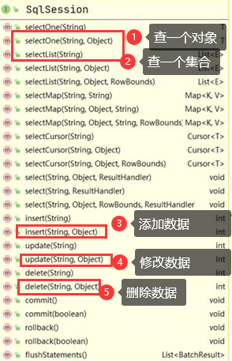

```java
package com.charlie.mapper;

// 演示使用MyBatis原生API操作
public class MyBatisNativeTest {
    private SqlSession sqlSession;
    @Before
    public void init() {
        sqlSession = MyBatisUtils.getSqlSession();
        // sqlSession返回的对象是DefaultSqlSession
        System.out.println("sqlSession=" + sqlSession.getClass());
    }

    @Test
    public void myBatisNativeCrud() {
        // 添加
        /**
         *     public int insert(String statement, Object parameter) {
         *         return this.update(statement, parameter);
         *     }
         *     statement:就是接口方法的完整声明
         *     parameter：传入参数
         */
        //Monster monster = new Monster();
        //monster.setAge(10);
        //monster.setBirthday(new Date());
        //monster.setEmail("kiki@qq.com");
        //monster.setGender(0);
        //monster.setName("黄风怪");
        //monster.setSalary(1010.0);
        //
        //int insert = sqlSession.insert("com.charlie.mapper.MonsterMapper.addMonster", monster);
        //System.out.println("insert=" + insert);

        // 删除
        //int delete = sqlSession.delete("com.charlie.mapper.MonsterMapper.delMonster", 6);
        //System.out.println("delete=" + delete);

        // 修改
        //Monster monster = new Monster();
        //monster.setId(5);       // 要有id，不然不知道要修改哪个数据
        //monster.setAge(10);
        //monster.setBirthday(new Date());
        //monster.setEmail("kiki@qq.com");
        //monster.setGender(0);
        //monster.setName("黄风怪");
        //monster.setSalary(1010.0);
        //int update = sqlSession.update("com.charlie.mapper.MonsterMapper.updateMonster", monster);
        //System.out.println("update=" + update);

        // 查询
        List<Monster> monsters = sqlSession.selectList("com.charlie.mapper.MonsterMapper.findAllMonsters");
        for (Monster monster : monsters) {
            System.out.println("monster=" + monster);
        }

        // 如果是增删改，需要提交事务
        if (sqlSession != null) {
            sqlSession.commit();    // 查询的时候，可以不用提交
            sqlSession.close();
        }
        System.out.println("保存成功...");
    }
}
```

### 注解方式完成接口方法配置

```java
package com.charlie.mapper;

import com.charlie.entity.Monster;
import org.apache.ibatis.annotations.*;

import java.util.List;

// MonsterAnnotation：使用注解的方式来配置接口
public interface MonsterAnnotation {
    // 添加monster
    /*
    1. 使用注解方式配置接口方法addMonster
        <insert id="addMonster" parameterType="Monster" useGeneratedKeys="true" keyProperty="id">
            INSERT INTO `monster`(`age`, `birthday`, `email`, `gender`, `name`, `salary`) VALUES
                (#{age}, #{birthday}, #{email}, #{gender}, #{name}, #{salary});
        </insert>
    2. useGeneratedKeys = true 返回自增长的值
    3. keyProperty = "id" 自增值对应的对象的属性
    4. keyColumn = "id" 自增值对应表的字段
    5. 如果keyColumn和ketProperty名字一致，则可以省略keyColumn，建议都写上
     */
    @Insert("INSERT INTO `monster`(`age`, `birthday`, `email`, `gender`, `name`, `salary`) VALUES " +
            "(#{age}, #{birthday}, #{email}, #{gender}, #{name}, #{salary})")
    @Options(useGeneratedKeys = true, keyProperty = "id", keyColumn = "id")
    public void addMonster(Monster monster);

    // 根据id删除一个monster
    /* xml文件中的配置
    <delete id="delMonster" parameterType="Integer">
        DELETE FROM `monster` WHERE id=#{id}
    </delete>
     */
    @Delete("DELETE FROM `monster` WHERE id=#{id}")
    public void delMonster(Integer id);

    // 修改Monster
    /* xml文件配置
        <update id="updateMonster" parameterType="Monster">
            UPDATE `monster` SET `age`=#{age}, `birthday`=#{birthday}, `email`=#{email}, `gender`=#{gender}, `name`=#{name},
                    `salary`=#{salary} WHERE `id`=#{id};
        </update>
     */
    @Update("UPDATE `monster` SET `age`=#{age}, `birthday`=#{birthday}, `email`=#{email}, `gender`=#{gender}, `name`=#{name}, " +
            "`salary`=#{salary} WHERE `id`=#{id}")
    public void updateMonster(Monster monster);

    // 查询-根据id
    /* xml文件配置
    <select id="getMonsterById" parameterType="Integer" resultType="Monster">
        SELECT * FROM `monster` WHERE `id`=#{id};
    </select>
     */
    @Select("SELECT * FROM `monster` WHERE `id`=#{id}")
    public Monster getMonsterById(Integer id);

    // 查询所有的Monster
    /* xml文件配置
        <select id="findAllMonsters" resultType="Monster">
            SELECT * FROM `monster`;
        </select>
     */
    @Select("SELECT * FROM `monster`")
    public List<Monster> findAllMonsters();
}
```

- 使用注解方法配置接口方法，需要在 `mybatis-config.xml`中配置

```xml
<mappers>
  <!--使用xml文件配置MonsterMapper接口的房啊-->
  <!--<mapper resource="com/charlie/mapper/MonsterMapper.xml"/>-->

  <!-- 通过注解方式配置
  1. 如果是通过注解的方式，可不再使用MonsterMapper.xml
  2. 但是还是需要在mybatis-config.xml中注册/引入含注解的类
  3. 如果没有引入，则不能使用
  -->
  <mapper class="com.charlie.mapper.MonsterAnnotation"/>
</mappers>
```

```java
package com.charlie.mapper;

// 测试注解方式配置接口方法
public class MonsterAnnotationTest {

    private SqlSession sqlSession;
    private MonsterAnnotation monsterAnnotation;

    @Before
    public void init() {
        sqlSession = MyBatisUtils.getSqlSession();
        monsterAnnotation = sqlSession.getMapper(MonsterAnnotation.class);
        // 返回的依然是一个接口的代理对象：class com.sun.proxy.$Proxy11
        System.out.println("monsterAnnotation=" + monsterAnnotation.getClass());
    }

    @Test
    public void addMonster() {
        Monster monster = new Monster();
        monster.setAge(120);
        monster.setBirthday(new Date());
        monster.setEmail("kiki@qq.com");
        monster.setGender(1);
        monster.setName("金角大王");
        monster.setSalary(1020.0);
        // 使用在接口方法中注解的方式完成配置
        monsterAnnotation.addMonster(monster);

        // 添加后monster的id
        System.out.println("添加后monster:id=" + monster.getId());

        if (sqlSession != null) {
            sqlSession.commit();
            sqlSession.close();
        }
        System.out.println("OK!");
    }
}
```

| 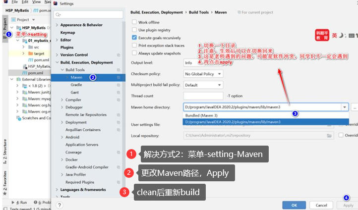 | 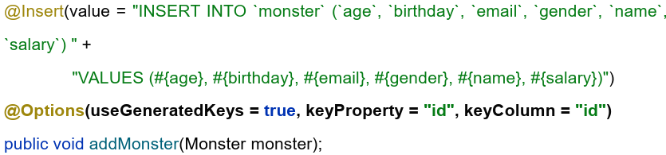 |
|---------------------------|---------------------------|

## mybatis-config.xml配置文件详解

1. mybatis的核心配置文件(`mybatis-config.xml`)，比如配置jdbc连接信息，注册mapper等等
2. 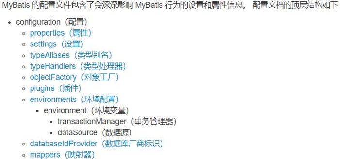

### properties属性

- 可以通过该属性，指定一个外部的 `jdbc.properties` 文件，引入jdbc连接信息
- [jdbc.properties文件](mybatis_quickstart/src/main/resources/jdbc.properties)

```xml
<?xml version="1.0" encoding="UTF-8" ?>
<!DOCTYPE configuration
        PUBLIC "-//mybatis.org//DTD Config 3.0//EN"
        "http://mybatis.org/dtd/mybatis-3-config.dtd">
<configuration>
   <properties resource="jdbc.properties"/>
   <environments default="development">
      <environment id="development">
         <!--配置事务管理器-->
         <transactionManager type="JDBC"/>
         <!--配置数据源
         1. 可以使用外部的properties文件来设置相关的值
         2. 这个属性文件，需要统一的放在resources目录，/类加载路径
         -->
         <dataSource type="POOLED">
            <!--配置驱动-->
            <property name="driver" value="${jdbc.driver}"/>
            <property name="url" value="${jdbc.url}"/>
            <property name="username" value="${jdbc.user}"/>
            <property name="password" value="${jdbc.pwd}"/>
         </dataSource>
      </environment>
   </environments>
</configuration>
```

### setting全局参数定义

- setting列表通常使用默认
  - 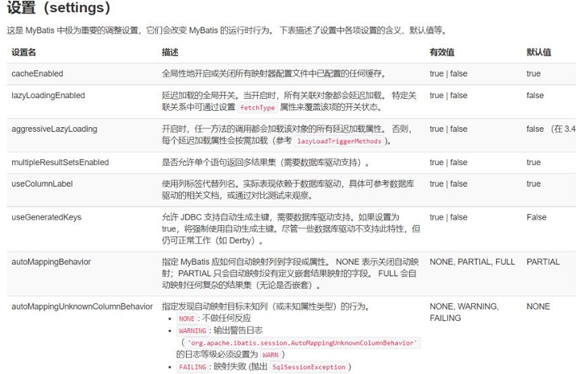
- 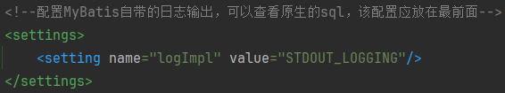

### typeAliases别名处理器

1. 别名是为Java类型命名一个短名字，它只和xml配置有关，用来减少类名重复的部分
   - 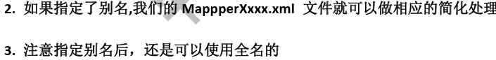
2. 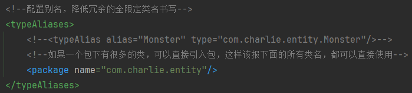

### typeHandlers类型处理器

1. 用于java类型和jdbc类型映射
   - 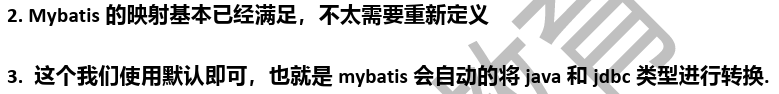

| 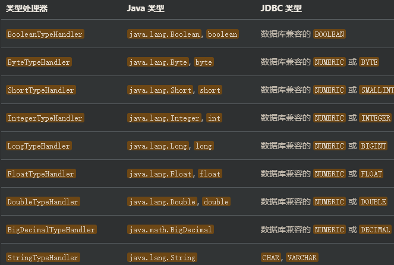 | 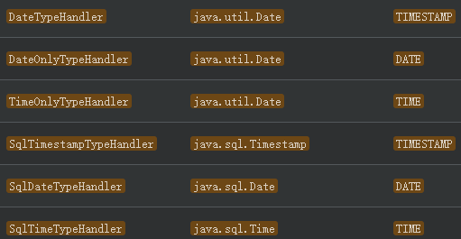 |
|---------------------------|---------------------------|

### environments环境

1. resource注册Mapper文件：XXXMapper.xml文件
   - 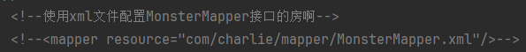
2. class：接口注解实现
   - 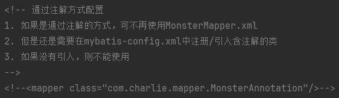
3. url：外部路径，使用很少
4. package方式注册
   - 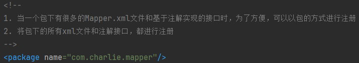

## xxxMapper.xml-SQL映射文件

1. `MyBatis`的真正强大在于它的语句映射(在XxxMapper.xml),它跟具有相同功能的JDBC代码相比节省了将近95%的代码
2. SQL映射文件常用的几个顶级元素
   1) cache:该命名空间的缓存配置
   2) cache-ref:引用其它命名空间的缓存配置
   3) resultMap:描述如何从数据库结果集中加载对象,是最复杂也是最强大的元素
   4) parameterType:将会传入这条语句的参数的类全限定名或别名
   5) sql:可被其它语句引用的可重用语句块
   6) insert(插入);update(更新);delete(删除);select(查询)

### parameterType(输入参数类型)

```xml
<?xml version="1.0" encoding="UTF-8" ?>
<!DOCTYPE mapper
        PUBLIC "-//mybatis.org//DTD Mapper 3.0//EN"
        "http://mybatis.org/dtd/mybatis-3-mapper.dtd">
<!--
1. 这是一个mapper xml文件
2. 该文件可以去实现对应的接口的方法
3. namespace指定该xml文件和哪个接口对应
-->
<mapper namespace="com.charlie.mapper.MonsterMapper">
    <!--
    1. 配置/实现 public List<Monster> findMonsterByNameORId(Monster monster);
    2. 通过id或者名字查询
    3. `id`=#{id}： `id`表示表的字段，#{id}表示传入monster对象的属性名
    -->
    <select id="findMonsterByNameORId" parameterType="Monster" resultType="Monster">
        SELECT * FROM `monster` WHERE `id`=#{id} OR `name`=#{name};
    </select>

    <!--
    1. 配置/实现public List<Monster> findMonsterByName(String name);
    2. 查询名字中包含 "精" 的妖怪
    3. 模糊查询的使用，取值需要使用 ${name}
    -->
    <select id="findMonsterByName" parameterType="String" resultType="Monster">
        SELECT * FROM `monster` WHERE `name` LIKE '%${name}%';
    </select>
    <!--
    1. 配置/实现 public List<Monster> findMonsterByIdAndSalary_ParameterHashMap(Map<String, Object> map);
    2. 查询 id > 3 并且 salary > 3000 的妖怪，要求使用HashMap形式参数
    3. 如果是以map形式传入参数，当条件为`id`>#{id}，表示map中有一个k-v的key是id
    -->
    <select id="findMonsterByIdAndSalary_ParameterHashMap" parameterType="map" resultType="Monster">
        SELECT * FROM `monster` WHERE `id`>#{id} AND `salary`>#{salary};
    </select>

    <!--
    1. 配置/实现public List<Map<String, Object>> findMonsterByIdAndSalary_ParameterHspMap_ReturnHashMap(Map<String, Object> map);
    2.查询 id > 3 并且 salary > 3000 的妖怪，要求参数类型和返回类型都是HashMap
    -->
    <select id="findMonsterByIdAndSalary_ParameterHspMap_ReturnHashMap" parameterType="map" resultType="map">
        SELECT * FROM `monster` WHERE `id`>#{id} AND `salary`>#{salary};
    </select>
</mapper>
```

```java
package com.charlie.mapper;

public class MonsterMapperTest {
    private SqlSession sqlSession;
    private MonsterMapper monsterMapper;

    @Before
    public void init() {
        sqlSession = MyBatisUtils.getSqlSession();
        monsterMapper = sqlSession.getMapper(MonsterMapper.class);
    }

    @Test
    public void findMonsterByNameORId() {
        Monster monster = new Monster();
        monster.setId(3);
        monster.setName("青牛怪");
        List<Monster> monsters = monsterMapper.findMonsterByNameORId(monster);
        for (Monster monster1 : monsters) {
            System.out.println("monster=" + monster1);
        }

        if (sqlSession != null) {
            //sqlSession.commit();    // 查，可以省略
            sqlSession.close();
        }

        System.out.println("OK!");
    }

    @Test
    public void findMonsterByName() {
        List<Monster> monsters = monsterMapper.findMonsterByName("怪");
        for (Monster monster1 : monsters) {
            System.out.println("monster=" + monster1);
        }

        if (sqlSession != null) {
            //sqlSession.commit();    // 查，可以省略
            sqlSession.close();
        }

        System.out.println("OK!");
    }

    @Test
    public void findMonsterByIdAndSalary_ParameterHashMap() {
        Map<String, Object> map = new HashMap<>();
        map.put("id", 4);
        map.put("salary", 1000);
        List<Monster> monsters = monsterMapper.findMonsterByIdAndSalary_ParameterHashMap(map);
        for (Monster monster : monsters) {
            System.out.println("monster=" + monster);
        }
        if (sqlSession != null) {
            sqlSession.close();
        }
        System.out.println("OK!");
    }

    @Test
    public void findMonsterByIdAndSalary_ParameterHspMap_ReturnHashMap() {
        Map<String, Object> map = new HashMap<>();
        map.put("id", 4);
        map.put("salary", 1000);
        List<Map<String, Object>> monsters = monsterMapper.findMonsterByIdAndSalary_ParameterHspMap_ReturnHashMap(map);

        // 以Map形式取出返回的结果
        for (Map<String, Object> monsterMap : monsters) {
            // monsterMap={birthday=2024-02-24, gender=0, name=黄风怪, id=5, salary=1010.0, age=10, email=kiki@qq.com}
            //System.out.println("monsterMap=" + monsterMap);

            // 遍历monsterMap，取出属性和对应值
            // 方式一：keySet()
            //Set<String> keys = monsterMap.keySet();
            //for (String key : keys) {
            //    System.out.println(key + "=>" + monsterMap.get(key));
            //}

            // 方式二：entrySet()
            for (Map.Entry<String, Object> entry : monsterMap.entrySet()) {
                System.out.println(entry.getKey() + "=>" + entry.getValue());
            }

            System.out.println("********");
        }

        if (sqlSession != null) {
            sqlSession.close();
        }
        System.out.println("OK!");
    }
}
```

### resultMap(结果集映射)

- 当实体类的属性和表的字段不一致时,可以通过 `resultMap` 进行映射,从而屏蔽实体类属性名和表的字段名不同的问题
- 当不一致时,返回结果集的属性值为默认值,null或者定义属性时的值(如`private String username = "jack";`)

```mysql
# 创建user表
CREATE TABLE `user` (
	`user_id` INT NOT NULL AUTO_INCREMENT,
	`user_email` VARCHAR(255) DEFAULT '',
	`user_name` VARCHAR(255) DEFAULT '',
	PRIMARY KEY (`user_id`)
)CHARSET=utf8;
```

```java
package com.charlie.entity;

@Setter
@Getter
@ToString
public class User { // entity
    private Integer user_id;
    private String username;
    private String useremail;
}
```

```sql
<?xml version="1.0" encoding="UTF-8" ?>
<!DOCTYPE mapper
        PUBLIC "-//mybatis.org//DTD Mapper 3.0//EN"
        "http://mybatis.org/dtd/mybatis-3-mapper.dtd">
<mapper namespace="com.charlie.mapper.UserMapper">
    <!--
    1. 配置方法public void addUser(User user);
    2. 完成添加用户的任务,注意这里的user属性和表的字段名有不一致的地方
    -->
    <insert id="addUser" parameterType="User">
        INSERT INTO `user`(`user_email`, `user_name`) VALUES (#{useremail}, #{username});
    </insert>

    <!--
    1. 配置/实现方法 public List<User> findAllUser();
    2. 返回所有的User信息
    3. 按照传统的方式,返回类型User会不会出什么问题?
        如果对象属性名和表字段名一致时,就会设置值;如果不同,就会是默认值(如null或者private String username = "charlie";)!
    4. 可以使用 resultMap解决
    5. resultMap:表示要定义一个resultMap
    6. id="findAllUser" => id就是指定 resultMap的id,以后可以通过id引用它
    7. type="User"      => type就是需要返回的对象类型
    8. <result column="user_email" property="useremail"/>: column是表是表的字段名,
                property是返回entity的属性名
    9. 表字段名和entity属性名并不一致也可以通过表别名解决,但是复用性不高,不推荐.用法如下:
        select `user_id`, `user_name` as `username`, `user_email` as `useremail` from `user`;
    -->
    <resultMap id="findAllUser" type="User">
        <result column="user_email" property="useremail"/>
        <result column="user_name" property="username"/>
    </resultMap>
    <select id="findAllUser" resultMap="findAllUser">
        SELECT * FROM `user`;
--         select `user_id`, `user_name` as `username`, `user_email` as `useremail` from `user`;
    </select>
</mapper>
```

### 注意事项和细节

1. 解决表字段和对象属性名不一致的问题,也支持使用字段别名
2. 如果 `MyBatis-Plus`,处理就比较见到那,可以使用注解 `@TableField`来解决,还可以使用 `@TableName`

## 动态SQL语句-更复杂的查询业务需求

1. 动态SQL是MyBatis的强大特性之一
2. 使用JDBC或其它类似的框架,根据不同的条件拼接SQL语句非常麻烦,例如拼接时要确保不能忘记添加必要的空格,还要注意去掉列表最后一个列名的逗号等
3. SQL映射语句中的强大的动态SQL语句,可以很好的解决这个问题
4. 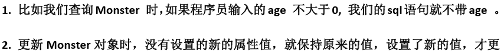

### 动态SQL常用标签

动态SQL提供了几种常用的标签,类似Java的控制语句:
1. if-判断
2. where-拼接where子句
3. choose-when-otherwise-类似java的switch语句,注意是单分支
4. foreach-类似in
5. trim-替换关键字/定制元素的功能
6. set-在update的set中,可以保证进入set标签的属性被修改,而没有进入set的保持原来的值

### 案例演示

```java
package com.charlie.mapper;

public interface MonsterMapper {
    // 根据age查询结果,测试if
    public List<Monster> findMonsterByAge(@Param(value = "age") Integer age);
    // 根据id和age查询结果.测试where
    public List<Monster> findMonsterByIdAndName(Monster monster);
    // 测试choose标签的使用
    public List<Monster> findMonsterByIdOrName_choose(Map<String, Object> map);
    // 测试foreach标签
    public List<Monster> findMonsterById_forEach(Map<String, Object> m);
    // 测试 trim
    public List<Monster> findMonsterByName_trim(Map<String, Object> map);
    // 测试 set
    public void updateMonster_set(Map<String, Object> map);
}
```

```xml
<?xml version="1.0" encoding="UTF-8" ?>
<!DOCTYPE mapper
        PUBLIC "-//mybatis.org//DTD Mapper 3.0//EN"
        "http://mybatis.org/dtd/mybatis-3-mapper.dtd">

<mapper namespace="com.charlie.mapper.MonsterMapper">
    <!--
    1. 配置/实现public List<Monster> findMonsterByAge(@Param(value = "age") Integer age);
    2. 请查询age大于10的所欲妖怪,如果输入的age不大于0,则输出所有的妖怪
    3. 按照以前的方式来配置->问题
            如果使用原来的 #{age},在test表达式中取不出参数值
    4. 解决方案是使用 @Param
    -->
    <select id="findMonsterByAge" parameterType="Integer" resultType="Monster">
        SELECT * FROM `monster` WHERE 1=1
        <if test="age > 0">
            AND `age`>#{age}
        </if>
    </select>

    <!--
    1. 配置/实现public List<Monster> findMonsterByIdAndName(Monster monster);
    2. 查询id大于4,且名字是青牛怪的记录,如果名字为空,则不包含名字条件;如果id小于等于0,则不包含id条件
    3. 如果传入参数是对象,那么在 <if test=""> 的test标签中直接使用属性名即可
    4. where标签:会在阻止动态sql时,加上where
    5. mybatis底层会自动地去掉多余的AND
    -->
    <select id="findMonsterByIdAndName" parameterType="Monster" resultType="Monster">
        SELECT * FROM `monster` -- 不需要再加 where,下面的where标签即是
        <where>
            <if test="id > 0">
                AND `id`>#{id}
            </if>
            <if test="name != null and name != ''">
                AND `name`=#{name}
            </if>
        </where>
    </select>

    <!--
    1. 配置/实现public List<Monster> findMonsterByIdOrName_choose(Map<String, Object> map);
    2.  1) 如果name不为空,就按名字查询
        2) 如果指定的id>0,就按id查询
        3) 如果都不符合,就查询 salary > 1000 的
    3. 使用mybatis提供的 choose-when-otherwise完成
    -->
    <select id="findMonsterByIdOrName_choose" parameterType="map" resultType="Monster">
        SELECT * FROM `monster`
        <choose>
            <when test="name != null and name != ''">
                WHERE `name`=#{name}
            </when>
            <when test="id > 0">
                WHERE `id`>#{id}
            </when>
            <otherwise>
                WHERE `salary`>1000
            </otherwise>
        </choose>
    </select>
    
    <!--
    1. 配置/实现public List<Monster> findMonsterById_forEach(Map<String, Object> map);
    2. 查询id为 4, 5, 6的妖怪
    3. 使用 foreach 标签
    4. 入参map中会如何传入id的值,k-v.如ids-[集合,把比如List]
    -->
    <select id="findMonsterById_forEach" parameterType="map" resultType="Monster">
        SELECT * FROM `monster`
        <!--
        1. where标签
        2. 再写入响应的代码,比如判断ids是否值为空
        3. 如果ids不为空,则使用foreach进行遍历
        4. collection="ids":对应入参的key
        5. item="id":在遍历ids集合时,每次取出的值,对应的变量为id
        6. open="(":对应的就是sql (4, 5, 6) 中的 (
        7. separator=",":遍历出来的多个值的分隔符号
        8. close=")":对应的就是sql (4, 5, 6) 中最后的 )
        9. #{id}:对应的前面的 item="id"
        -->
        <if test="ids != null and ids != ''">
            <where>
                id IN
                <foreach collection="ids" item="id" open="(" separator="," close=")">
                    #{id}
                </foreach>
            </where>
        </if>
    </select>

    <!--
    1. 配置/实现public List<Monster> findMonsterByName_trim(Map<String, Object> map);
    2. 按照名字和年龄查询妖怪,如果sql语句开头有 and | or 就替换成 where
    3. 使用where标签会加入where标签,同时去掉多余的AND
        where元素只会在子元素返回的内容开头有 AND 或 OR 的时候,根据条件去掉多余的 AND
    4. <trim prefix="WHERE" prefixOverrides="and|or|hsp">:如果子句的开头有and或or或者hsp,
        就将其去除多余的
    5. 如下面的hsp,虽然非法,但是是在第一个子句的开头,始终都会被去掉,所以不会报错
    -->
    <select id="findMonsterByName_trim" parameterType="map" resultType="Monster">
        select * from `monster`
        <trim prefix="WHERE" prefixOverrides="and|or|hsp">
            <if test="name != null and name != ''">
                hsp `name`=#{name}
            </if>
            <if test="age != null and age != ''">
                AND `age`>#{age}
            </if>
        </trim>
    </select>

    <!--
    1. 配置/实现public void updateMonster_set(Map<String, Object> map);
    2. 对指定id的妖怪进行属性修改,如果没有设置的属性,则保持原来的值
    3. 入参要根据SQL语句配合
    4. set标签中sql语句都加上逗号, 最终多余的逗号会被去掉,但是不会自动加上逗号,注意!
    -->
   <update id="updateMonster_set" parameterType="map">
       UPDATE `monster`
       <set>
            <if test="age != null and age != ''">
                `age`=#{age},
            </if>
           <if test="email != null and email != ''">
               `email`=#{email},
           </if>
           <if test="name != null and name != ''">
               `name`=#{name},
           </if>
           <if test="birthday != null and birthday != ''">
               `birthday`=#{birthday},
           </if>
           <if test="salary != null and salary != ''">
               `salary`=#{salary},
           </if>
           <if test="gender != null and gender != ''">
               `gender`=#{gender},
           </if>
       </set>
       WHERE `id`=#{id}
   </update>
</mapper>
```

```java
package com.charlie.mapper;

public class MonsterMapperTest {
    private SqlSession sqlSession;
    private MonsterMapper monsterMapper;

    @Before
    public void init() {
        sqlSession = MyBatisUtils.getSqlSession();
        monsterMapper = sqlSession.getMapper(MonsterMapper.class);
        System.out.println("monsterMapper=" + monsterMapper.getClass());
    }

    // 测试 if 标签
    @Test
    public void findMonsterByAge() {
        List<Monster> monsters = monsterMapper.findMonsterByAge(-1);
        for (Monster monster : monsters) {
            System.out.println("monster=" + monster);
        }

        if (sqlSession != null) {
            sqlSession.close();
        }
        System.out.println("OK!");
    }

    // 测试 where 标签
    @Test
    public void findMonsterByIdAndName() {
        Monster monster = new Monster();
        monster.setId(4);
        monster.setName("");
        List<Monster> monsters = monsterMapper.findMonsterByIdAndName(monster);
        for (Monster monster1 : monsters) {
            System.out.println("monster=" + monster1);
        }

        if (sqlSession != null) {
            sqlSession.close();
        }
        System.out.println("OK!");
    }

    // 测试 choose-when-otherwise 标签
    @Test
    public void findMonsterByIdOrName_choose() {
        Map<String, Object> map = new HashMap<>();
        //map.put("name", "青牛怪");
        map.put("id", -1);
        List<Monster> monsters = monsterMapper.findMonsterByIdOrName_choose(map);
        for (Monster monster : monsters) {
            System.out.println("monster=" + monster);
        }

        if (sqlSession != null) {
            sqlSession.close();
        }
        System.out.println("OK!");
    }

    // 测试 foreach
    @Test
    public void findMonsterById_forEach() {
        Map<String, Object> map = new HashMap<>();
        map.put("ids", Arrays.asList(4, 5, 6));
        List<Monster> monsters = monsterMapper.findMonsterById_forEach(map);
        for (Monster monster : monsters) {
            System.out.println("monster=" + monster);
        }

        if (sqlSession != null) {
            sqlSession.close();
        }
        System.out.println("OK!");
    }

    // 测试 trim
    @Test
    public void findMonsterByName_trim() {
        Map<String, Object> map = new HashMap<>();
        map.put("name", "青牛怪");
        map.put("age", 20);
        List<Monster> monsters = monsterMapper.findMonsterByName_trim(map);
        for (Monster monster : monsters) {
            System.out.println("monster=" + monster);
        }

        if (sqlSession != null) {
            sqlSession.close();
        }
        System.out.println("OK!");
    }

    // 测试 set标签
    @Test
    public void updateMonster_set() {
        Map<String, Object> map = new HashMap<>();
        map.put("id", 8);
        map.put("name", "老鼠精");
        map.put("age", 125);
        monsterMapper.updateMonster_set(map);

        // 修改需要commit
        if (sqlSession != null) {
            sqlSession.commit();
            sqlSession.close();
        }
        System.out.println("OK!");
    }
}
```

## 映射关系一对一

1. 项目中1对1的关系是一个基本的映射关系，比如：Person(人)-IDCard(身份证)
2. 在Mybatis中可以通过配置`XxxMapper.xml`文件或者通过注解方式实现1对1
3. 这里实现的查询是指通过1对1，查询person信息，同时**级联查询**到对应的IdenCard信息

```mysql
# 映射关系——一对一
USE `mybatis`;
-- 创建person表
CREATE TABLE `person` (
 `id` INT PRIMARY KEY AUTO_INCREMENT,
 `name` VARCHAR(32) NOT NULL DEFAULT '',
 `card_id` INT,	-- 对应idencard的主键id
 FOREIGN KEY (`card_id`) REFERENCES `idencard`(`id`) -- 外键
)CHARSET=utf8;
-- 创建 idencard表
CREATE TABLE `idencard` (
 `id` INT PRIMARY KEY AUTO_INCREMENT,
 `card_sn` VARCHAR(32) NOT NULL DEFAULT ''
)CHARSET=utf8;
-- 插入数据
INSERT INTO `idencard` VALUES (1, '111111111110');
INSERT INTO `idencard` VALUES (200, '222222222220');
INSERT INTO `person` VALUES (1, '张三', 1);
INSERT INTO `person` VALUES (8, '李四', 200);
-- 结果
SELECT * FROM `person`;
SELECT * FROM `idencard`;
-- 多表联查
SELECT * FROM `person`, `idencard` WHERE `person`.id=1 AND person.card_id=idencard.id;
```

```java
package com.charlie.entity;

@ToString
@Getter
@Setter
public class Person {
    /**
     * CREATE TABLE `person` (
     *  `id` INT PRIMARY KEY AUTO_INCREMENT,
     *  `name` VARCHAR(32) NOT NULL DEFAULT '',
     *  `card_id` INT,	-- 对应idencard的主键id
     *  FOREIGN KEY (`card_id`) REFERENCES `idencard`(`id`) -- 外键
     * )CHARSET=utf8;
     */
    private Integer id;
    private String name;
    // 因为我们要实现一个级联操作，一个人需要对应一个身份证
    // 所以这里需要直接定义IdenCard，属性名自定义
    // X private Integer card_id; X
    private IdenCard card;
}
```

### 配置Mapper.xml方式

```java
package com.charlie.mapper;

public interface IdenCardMapper {
    // 根据id获取身份证序列号
    public IdenCard getIdenCardById(Integer id);
    // 通过id查询身份证信息，并返回其对应的person信息
    public IdenCard getIdenCardById2(Integer id);
}
```

```xml
<?xml version="1.0" encoding="UTF-8" ?>
<!DOCTYPE mapper
        PUBLIC "-//mybatis.org//DTD Mapper 3.0//EN"
        "http://mybatis.org/dtd/mybatis-3-mapper.dtd">
<mapper namespace="com.charlie.mapper.IdenCardMapper">
    <!--
    1. 据id获取身份证序列号
    2. 配置/实现 public IdenCard getIdenCardById(Integer id);-->
    <select id="getIdenCardById" parameterType="Integer" resultType="IdenCard">
        select * from `idencard` where `id`=#{id};
    </select>

    <!--
    1. 根据id查询身份证信息，并级联查询对应person的数据
    2.public IdenCard getIdenCardById2(Integer id);
    -->
    <resultMap id="id1" type="IdenCard">
        <id property="id" column="id"/>
        <result property="card_sn" column="card_sn"/>
        <association property="person" column="id" select="com.charlie.mapper.PersonMapper.getPersonByCardId"/>
    </resultMap>
    <select id="getIdenCardById2" parameterType="Integer" resultMap="id1">
        select * from `idencard` where `id`=#{id};
    </select>
</mapper>
```

```java
package com.charlie.mapper;

import com.charlie.entity.Person;

public interface PersonMapper {
    // 通过id查询person，包含这个person关联的IndeCard对象
    public Person getPersonById(Integer id);
    // 方式2
    public Person getPersonById2(Integer id);
    // 根据card_id查询person信息
    public Person getPersonByCardId(Integer card_id);
}
```

```xml
<?xml version="1.0" encoding="UTF-8" ?>
<!DOCTYPE mapper
        PUBLIC "-//mybatis.org//DTD Mapper 3.0//EN"
        "http://mybatis.org/dtd/mybatis-3-mapper.dtd">
<mapper namespace="com.charlie.mapper.PersonMapper">
    <!--
    1. 据id获取Person对象，同时包含对应的IdenCard对象
    2. 配置/实现 public Person getPersonById(Integer id);
    3. 为了加深理解，先使用容易象到的方法，再分析问题
    4. 如果简单的设置为：resultType="Person"，则person返回的属性card为null，没有实现级联查询
    5. 自定义resultMap，定义返回的结果
    6. 因为getPersonById最终返回的仍然是Person对象，只是有级联的对象，type仍然配置为 type="Person"
    -->
    <resultMap id="PersonResultMap" type="Person">
        <!--属性按照sql语句返回结果顺序匹配-->
        <!--<result property="id" column="id"/>-->
        <!--id-一个Id结果，标记出作为ID的结果可以帮助提高整体性能
        1. property="id" 表示person的属性id，通常是主键
        2. column="id" 表示对应表的字段名
        -->
        <id property="id" column="id"/>
        <result property="name" column="name"/>
        <!-- association：一个复杂类型的关联
        1. property="card" 表示对Person对象的card属性
        2. javaType="IdenCard" 表示card属性的类型
        3. column="id" 是从限免的sql语句中查询返回的字段
        -->
        <association property="card" javaType="IdenCard">
            <result property="id" column="id"/>
            <result property="card_sn" column="card_sn"/>
        </association>
    </resultMap>
    <select id="getPersonById" parameterType="Integer" resultMap="PersonResultMap">
        SELECT * FROM `person`, `idencard` WHERE `person`.id=#{id} AND person.card_id=idencard.id;
    </select>

    <!--
    1. 配置/实现方式二：public Person getPersonById2(Integer id);
    2. 这里的方式和前面的不同：
        1) 先通过 select * from `person` where `id`=#{id} 返回person的信息
        2) 再通过card_id值，再执行操作，得到IdenCard数据
    -->
    <resultMap id="PersonResultMap2" type="Person">
        <id property="id" column="id"/>
        <result property="name" column="name"/>
        <!--
        1. 第二种方式核心思想：将多表查询，分解为多条单表操作，这样简洁易操作，复用性强，推荐！
        2. 而且可以复用前面已经写好的方法-组合使用！在表很多的情况下，非常实用
        3. property="card" 表示Person对象的card属性
        4. column="card_id" 是 select * from `person` where `id`=#{id} 返回的字段card_id
        5. 返回的字段card_id值，会作为getIdenCardById传入参数，来执行
                select `id`, `name`, `card_id` as `hsp_id` from `person` where `id`=#{id}
                如果使用上面的sql语句，则association中column="hsp_id"
        -->
        <association property="card"
                     column="card_id"
                     select="com.charlie.mapper.IdenCardMapper.getIdenCardById"/>
    </resultMap>
    <select id="getPersonById2" parameterType="Integer" resultMap="PersonResultMap2">
        select * from `person` where `id`=#{id}
    </select>

    <!--配置/实现public Person getPersonByCardId(Integer card_id);-->
    <select id="getPersonByCardId" parameterType="Integer" resultType="Person">
        select * from `person` where `card_id`=#{card_id}
    </select>
</mapper>
```

### 注解方式

```java
package com.charlie.mapper;

import com.charlie.entity.IdenCard;
import org.apache.ibatis.annotations.Select;

// 使用注解方式实现一对一映射
public interface IdenCardMapperAnnotation {
    @Select("select * from `idencard` where `id`=#{id}")
    public IdenCard getIdenCardById(Integer id);
}
```

```java
package com.charlie.mapper;

import com.charlie.entity.Person;
import org.apache.ibatis.annotations.One;
import org.apache.ibatis.annotations.Result;
import org.apache.ibatis.annotations.Results;
import org.apache.ibatis.annotations.Select;

public interface PersonMapperAnnotation {
    // 注解实现级联查询，注解形式就是对xml配置方式的改写
    @Select("select * from `person` where `id`=#{id}")
    @Results({
            @Result(id = true, property = "id", column = "id"),
            @Result(property = "name", column = "name"),
            @Result(property = "card", column = "card_id",
                    one = @One(select = "com.charlie.mapper.IdenCardMapper.getIdenCardById"))
    })
    public Person getPersonById(Integer id);
}
```

### 注意事项和使用细节

1. 在实际开发种，还是推荐使用**xml文件配置**方式
2. **表是否设置外键，对MyBatis进行对象/级联映射没有影响**

## 映射关系多对一

1. 项目中多对1的关系是一个基本的映射关系，多对1也可以理解成是1对多
2. 如一个User可以养多只Pet

```mysql
# 映射关系多对一
-- 创建mybatis_user表
CREATE TABLE `mybatis_user` (
 `id` INT PRIMARY KEY AUTO_INCREMENT,
 `name` VARCHAR(32) NOT NULL DEFAULT ''
)CHARSET=utf8;
-- 创建mybatis_pet表
CREATE TABLE `mybatis_pet` (
 `id` INT PRIMARY KEY AUTO_INCREMENT,
 `nickname` VARCHAR(32) NOT NULL DEFAULT '',
 `user_id` INT,
 FOREIGN KEY (`user_id`) REFERENCES `mybatis_user`(`id`)
)CHARSET=utf8;
-- 插入数据
INSERT INTO `mybatis_user` VALUES (NULL, '宋江'), (NULL, '李逵');
INSERT INTO `mybatis_pet` VALUES (NULL, '小白', 1), (NULL, '小黑', 1), (NULL, '阿星', 2), (NULL, '阿宝', 2);
```

```java
package com.charlie.entity;

@Getter
@Setter
//@ToString
public class Pet {
    /**
     * -- 创建mybatis_pet表
     * CREATE TABLE `mybatis_pet` (
     *  `id` INT PRIMARY KEY AUTO_INCREMENT,
     *  `nickname` VARCHAR(32) NOT NULL DEFAULT '',
     *  `user_id` INT,
     *  FOREIGN KEY (`user_id`) REFERENCES `mybatis_user`(`id`)
     * )CHARSET=utf8;
     */
    private Integer id;
    private String nickname;
    private User user;  // 一个pet对应的一个user对象

    @Override
    public String toString() {
        return "Pet{" +
                "id=" + id +
                ", nickname='" + nickname + '\'' +
                '}';
    }
}
```

```java
package com.charlie.entity;

@Getter
@Setter
//@ToString   // 会造成栈溢出
public class User {
    /**
     * CREATE TABLE `mybatis_user` (
     *  `id` INT PRIMARY KEY AUTO_INCREMENT,
     *  `name` VARCHAR(32) NOT NULL DEFAULT ''
     * )CHARSET=utf8;
     */
    private Integer id;
    private String name;
    // 因为一个User对象可以养多条宠物，mybatis使用集合体现这个关系
    private List<Pet> pets;

    @Override
    public String toString() {
        return "User{" +
                "id=" + id +
                ", name='" + name + '\'' +
                '}';
    }
}
```

### 配置XxxMapper.xml方式

```java
package com.charlie.mapper;

public interface PetMapper {
    // 通过User的id来获取pet对象，可能有多个，因此使用List接收
    public List<Pet> getPetByUserId(Integer userId);
    // 通过pet的id返回Pet对象
    public Pet getPetById(Integer id);
}
```

```xml
<?xml version="1.0" encoding="UTF-8" ?>
<!DOCTYPE mapper
        PUBLIC "-//mybatis.org//DTD Mapper 3.0//EN"
        "http://mybatis.org/dtd/mybatis-3-mapper.dtd">
<mapper namespace="com.charlie.mapper.PetMapper">
    <!--通过User的id来获取pet对象，可能有多个，因此使用List接收
    public List<Pet> getPetByUserId(Integer userId);-->
    <resultMap id="PetResultMap" type="Pet">
        <id property="id" column="id"/>
        <result property="nickname" column="nickname"/>
        <association property="user" column="user_id" select="com.charlie.mapper.UserMapper.getUserById"/>
    </resultMap>
    <select id="getPetByUserId" parameterType="Integer" resultMap="PetResultMap">
        select * from `mybatis_pet` where `user_id`=#{userId}
    </select>
    
    <!--// 通过pet的id返回Pet对象
    配置/实现 public Pet getPetById(Integer id);-->
    <resultMap id="PetResultMap2" type="Pet">
        <id property="id" column="id"/>
        <result property="nickname" column="nickname"/>
        <association property="user" column="user_id" select="com.charlie.mapper.UserMapper.getUserById"/>
    </resultMap>
    <select id="getPetById" parameterType="Integer" resultMap="PetResultMap2">
        select * from `mybatis_pet` where `id`=#{id}
    </select>
</mapper>
```

```java
package com.charlie.mapper;

public interface UserMapper {
    // 根据id返回User对象
    public User getUserById(Integer id);
}
```

```xml
<?xml version="1.0" encoding="UTF-8" ?>
<!DOCTYPE mapper
        PUBLIC "-//mybatis.org//DTD Mapper 3.0//EN"
        "http://mybatis.org/dtd/mybatis-3-mapper.dtd">
<mapper namespace="com.charlie.mapper.UserMapper">
    <!--根据id返回User对象
    1. 配置/实现 public User getUserById(Integer id);
    2. 思路：先通过传入的id查询得到用户的信息，再通过id查询对应的宠物信息，
        并映射到User的pets属性
    -->
    <resultMap id="UserResultMap" type="User">
        <id property="id" column="id"/>
        <result property="name" column="name"/>
        <!--因为pets属性是集合，所以这里需要是collection标签来处理
        1. ofType="Pet" 指定返回的集合中存放的数据类型是Pet
        3. collection：表示pets属性是一个集合
        4. property="pets"：表示返回的User对象的属性pets
        5. column="id" 表示SQL语句返回的id字段对应的值
        -->
        <collection property="pets" column="id" ofType="Pet"
                    select="com.charlie.mapper.PetMapper.getPetByUserId"/>
    </resultMap>
    <select id="getUserById" resultMap="UserResultMap" parameterType="Integer">
        select * from `mybatis_user` where `id`=#{id};
    </select>
</mapper>
```

- [PetMapperTest.java](mybatis-mapping/src/test/java/com/charlie/mapper/PetMapperTest.java)
- [UserMapperTest.java](mybatis-mapping/src/test/java/com/charlie/mapper/UserMapperTest.java)

### 注解方式

```java
package com.charlie.mapper;

import com.charlie.entity.Pet;
import org.apache.ibatis.annotations.*;

import java.util.List;

public interface PetMapperAnnotation {
    /**
     * 通过User的id来获取pet对象，可能有多个，因此使用List接收
     *     public List<Pet> getPetByUserId(Integer userId);-->
     *     <resultMap id="PetResultMap" type="Pet">
     *         <id property="id" column="id"/>
     *         <result property="nickname" column="nickname"/>
     *         <association property="user" column="user_id" select="com.charlie.mapper.UserMapper.getUserById"/>
     *     </resultMap>
     *     <select id="getPetByUserId" parameterType="Integer" resultMap="PetResultMap">
     *         select * from `mybatis_pet` where `user_id`=#{userId}
     *     </select>
     * 1. 这里的id就是给@Results 起个名字，方便复用
     * 2. @ResultMap("PetResultMap") 引用上面定义的 @Results
     */
    @Select("select * from `mybatis_pet` where `user_id`=#{id}")
    @Results(id = "PetResultMap", value = {
            @Result(id = true, property = "id", column = "id"),
            @Result(property = "nickname", column = "nickname"),
            @Result(property = "user", column = "user_id", one = @One(select = "com.charlie.mapper.UserMapperAnnotation.getUserById"))
    })
    public List<Pet> getPetByUserId(Integer userId);

    /**
     * 通过pet的id返回Pet对象
     *     <resultMap id="PetResultMap2" type="Pet">
     *         <id property="id" column="id"/>
     *         <result property="nickname" column="nickname"/>
     *         <association property="user" column="user_id" select="com.charlie.mapper.UserMapper.getUserById"/>
     *     </resultMap>
     *     <select id="getPetById" parameterType="Integer" resultMap="PetResultMap2">
     *         select * from `mybatis_pet` where `id`=#{id}
     *     </select>
     */
    @Select("select * from `mybatis_pet` where `id`=#{id}")
    @ResultMap("PetResultMap")
    public Pet getPetById(Integer id);
}
```

```java
package com.charlie.mapper;

import com.charlie.entity.User;
import org.apache.ibatis.annotations.Many;
import org.apache.ibatis.annotations.Result;
import org.apache.ibatis.annotations.Results;
import org.apache.ibatis.annotations.Select;

public interface UserMapperAnnotation {
    /**
     * 注解形式的配置就是对应xml文件配置的改写
     *     <resultMap id="UserResultMap" type="User">
     *         <id property="id" column="id"/>
     *         <result property="name" column="name"/>
     *         <collection property="pets" column="id" ofType="Pet"
     *                     select="com.charlie.mapper.PetMapper.getPetByUserId"/>
     *     </resultMap>
     *     <select id="getUserById" resultMap="UserResultMap" parameterType="Integer">
     *         select * from `mybatis_user` where `id`=#{id};
     *     </select>
     */
    @Select("select * from `mybatis_user` where `id`=#{id}")
    @Results({
            @Result(id = true, property = "id", column = "id"),
            @Result(property = "name", column = "name"),
            // 这里需要注意，pets属性user对应的是集合
            @Result(property = "pets", column = "id",
                    many = @Many(select = "com.charlie.mapper.PetMapperAnnotation.getPetByUserId"))
    })
    public User getUserById(Integer id);
}
```
