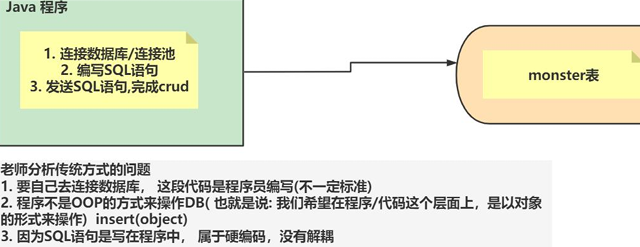
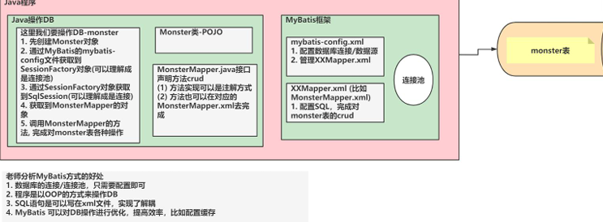
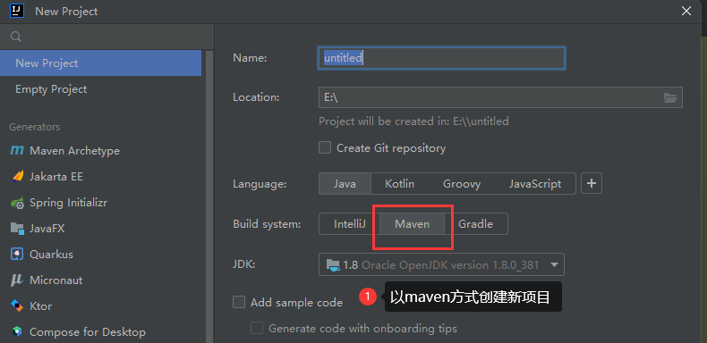
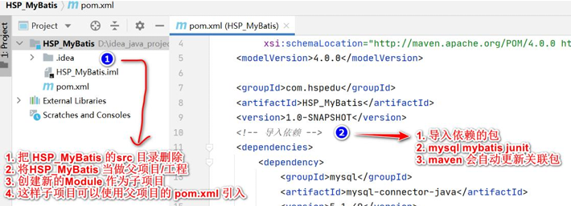
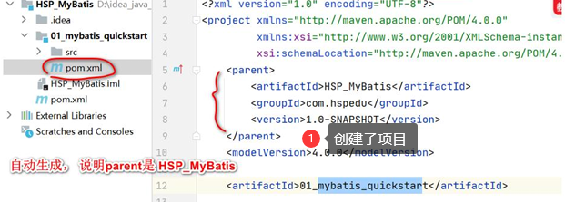
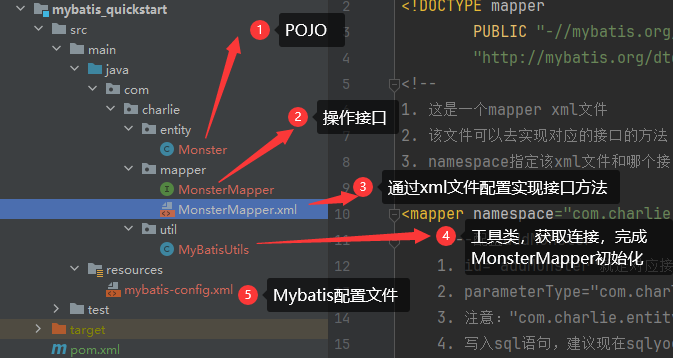
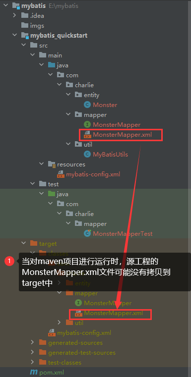
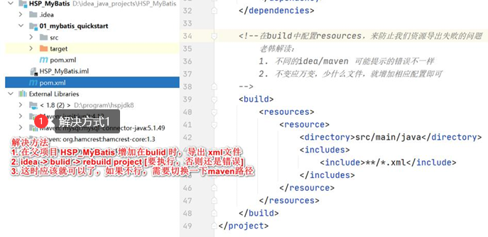
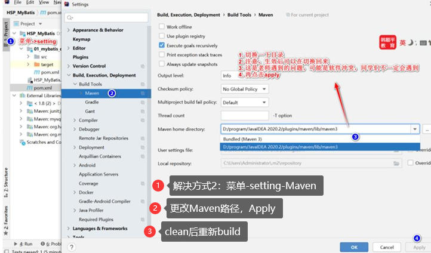
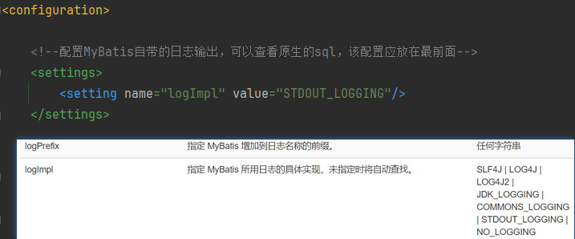

# MyBatis

## MyBatis介绍

- [MyBatis中文手册](https://mybatis.net.cn)
- [Maven仓库](https://mvnrepository.com)

1. 传统方式Java程序操作DB
   - Java程序：连接数据库/连接池；编写SQL语句；发送SQL，完成crud
   - 问题：要自己连接数据库，即代码由程序员编写，不一定标准；程序不是通过OOP的方式来操作；
     SQL语句是写在程序中，属于硬编码，没有解耦
   - 
2. MyBatis是一个持久层框架，前身是ibatis，在ibatis3.x时，更名为MyBatis
   - MyBatis在java和sql之间提供了更灵活的映射方案
   - MyBatis可以将对数据库表的操作(sql)等等直接剥离，写到xml配置文件，实现和java代码的解耦
   - MyBatis通过SQL操作DB，建库建表的工作需要程序员完成
   - 

## 快速入门

> 要求：开发一个MyBatis项目，通过MyBatis方法完成对monster表的crud操作

### 代码实现

1. 创建mybatis数据库、monster表

```mysql
-- 创建mybatis数据库
create database if not exists `mybatis`;
use `mybatis`;
-- 创建monster表
create table `monster`
(
    `id` int not null auto_increment,
   `age` int not null,
   `birthday` date default null,
   `email` varchar(255) not null,
   `gender` tinyint not null,
   `name` varchar(255) not null,
   `salary` double not null,
   primary key (`id`)
)charset=utf8;
```

|  |  |  |  |
|-------------------------|-------------------------|-------------------------|-------------------------|

```xml
<?xml version="1.0" encoding="UTF-8"?>
<project xmlns="http://maven.apache.org/POM/4.0.0"
         xmlns:xsi="http://www.w3.org/2001/XMLSchema-instance"
         xsi:schemaLocation="http://maven.apache.org/POM/4.0.0 http://maven.apache.org/xsd/maven-4.0.0.xsd">
    <modelVersion>4.0.0</modelVersion>

    <!--
    1. 将mybatis作为父项目管理多个子模块/子项目
    2. 父项目的完整坐标 groupId[阻止名]+artifactId[项目名]
    3. 该父项目会管理多个子模块，将来父项目中引入的依赖可以直接给子项目使用，这样开发简单，提高复用性且便于管理
    4. <packaging>pom</packaging> 表示父项目以多个子模块/子项目管理工程
    -->
    <groupId>com.charlie</groupId>
    <artifactId>mybatis</artifactId>
    <version>1.0-SNAPSHOT</version>
    <packaging>pom</packaging>
    <!--在modules指定管理哪些子模块-->
    <modules>
        <module>mybatis_quickstart</module>
    </modules>

    <!--加入依赖-->
    <dependencies>
        <!--mysql依赖-->
        <dependency>
            <groupId>mysql</groupId>
            <artifactId>mysql-connector-java</artifactId>
            <version>5.1.49</version>
        </dependency>
        <!--mybatis依赖-->
        <dependency>
            <groupId>org.mybatis</groupId>
            <artifactId>mybatis</artifactId>
            <version>3.5.7</version>
        </dependency>
        <!--junit依赖-->
        <dependency>
            <groupId>junit</groupId>
            <artifactId>junit</artifactId>
            <version>4.12</version>
            <!--scope表示该jar包的作用范围在test目录下-->
            <scope>test</scope>
        </dependency>
    </dependencies>

    <!--在build中配置resources，来防止资源导出失败的问题
    1. 不同的idea/maven，可能提示的错误不一样
    2. 不变应万变，少什么文件，就增加响应配置即可
    3. 含义是将 src/main/java 目录和子目录 以及 src/main/resources 目录和子目录下的资源文件(xml文件)
            在build项目时，导出到对应的target目录下
    -->
    <build>
        <resources>
            <resource>
                <directory>src/main/java</directory>
                <includes>
                    <include>**/*.xml</include>
                </includes>
            </resource>
            <resource>
                <directory>src/main/resources</directory>
                <includes>
                    <include>**/*.xml</include>
                    <include>**/*.properties</include>
                </includes>
            </resource>
        </resources>
    </build>

    <properties>
        <maven.compiler.source>8</maven.compiler.source>
        <maven.compiler.target>8</maven.compiler.target>
        <project.build.sourceEncoding>UTF-8</project.build.sourceEncoding>
    </properties>
</project>
```

2. 在`resources`目录下创建`mybatis-config.xml`配置文件

```xml
<?xml version="1.0" encoding="UTF-8" ?>
<!DOCTYPE configuration
        PUBLIC "-//mybatis.org//DTD Config 3.0//EN"
        "http://mybatis.org/dtd/mybatis-3-config.dtd">
<configuration>

    <!--配置MyBatis自带的日志输出，可以查看原生的sql，该配置应放在最前面-->
    <settings>
        <setting name="logImpl" value="STDOUT_LOGGING"/>
    </settings>

    <!--配置别名，降低冗余的全限定类名书写-->
    <typeAliases>
        <typeAlias alias="Monster" type="com.charlie.entity.Monster"/>
    </typeAliases>

    <environments default="development">
        <environment id="development">
            <!--配置事务管理器-->
            <transactionManager type="JDBC"/>
            <!--配置数据源-->
            <dataSource type="POOLED">
                <!--配置驱动-->
                <property name="driver" value="com.mysql.jdbc.Driver"/>
                <!--配置连接mysql的url
                1. jdbc:mysql 连接协议
                2. 127.0.0.1:3306：指定连接mysql的ip+port
                3. mybatis：连接的DB
                4. useSSL=true：表示使用安全连接
                5. &amp;表示&符号，用于连接参数，防止解析错误
                6. useUnicode=true：使用unicode，防止编码错误
                7. characterEncoding=UTF-8：指定使用utf-8，防止中文乱码
                8. 不需要记忆，理解即可
                -->
                <property name="url" value="jdbc:mysql://127.0.0.1:3306/mybatis?useSSL=true&amp;useUnicode=true&amp;characterEncoding=UTF-8"/>
                <property name="username" value="root"/>
                <property name="password" value="hsp"/>
            </dataSource>
        </environment>
    </environments>
    <!--
    1. 这里配置需要关联的Mapper.xml
    2. 这里可以通过copy path from source root
    -->
    <mappers>
        <mapper resource="com/charlie/mapper/MonsterMapper.xml"/>
    </mappers>
</configuration>
```

3. 编写Monster类

```java
package com.charlie.entity;
/* Monster对象 和 monster表对应，体现OOP
1. 这是一个普通的POJO类
2. 使用原生的sql语句查询结果还是要封装成对象
3. 要求这里的实体类属性名和表名字段保持一致
 */
public class Monster {
    /*
    CREATE TABLE monster (
        `id` INT NOT NULL AUTO_INCREMENT,
        `age` INT NOT NULL,
        `birthday` DATE DEFAULT NULL,
        `email` VARCHAR(255) NOT NULL,
        `gender` TINYINT NOT NULL,
        `name` VARCHAR(255) NOT NULL,
        `salary` DOUBLE NOT NULL,
        PRIMARY KEY(`id`)
    )CHARSET=utf8;
     */
    // 属性-和表的字段有对应关系
    private Integer id;
    private Integer age;
    private String name;
    private String email;
    private Date birthday;
    private Double salary;
    private Integer gender;

    public Monster() {}

    public Monster(Integer id, Integer age, String name, String email, Date birthday, Double salary, Integer gender) {
        this.id = id;
        this.age = age;
        this.name = name;
        this.email = email;
        this.birthday = birthday;
        this.salary = salary;
        this.gender = gender;
    }

    @Override
    public String toString() {
        return "Monster{" +
                "id=" + id +
                ", age=" + age +
                ", name='" + name + '\'' +
                ", email='" + email + '\'' +
                ", birthday=" + birthday +
                ", salary=" + salary +
                ", gender=" + gender +
                '}';
    }

    public Integer getId() {
        return id;
    }

    public void setId(Integer id) {
        this.id = id;
    }

    public Integer getAge() {
        return age;
    }

    public void setAge(Integer age) {
        this.age = age;
    }

    public String getName() {
        return name;
    }

    public void setName(String name) {
        this.name = name;
    }

    public String getEmail() {
        return email;
    }

    public void setEmail(String email) {
        this.email = email;
    }

    public Date getBirthday() {
        return birthday;
    }

    public void setBirthday(Date birthday) {
        this.birthday = birthday;
    }

    public Double getSalary() {
        return salary;
    }

    public void setSalary(Double salary) {
        this.salary = salary;
    }

    public Integer getGender() {
        return gender;
    }

    public void setGender(Integer gender) {
        this.gender = gender;
    }
}
```

4. 编写`MonsterMapper`接口

```java
package com.charlie.mapper;
/*
1. 这是一个接口
2. 该接口用于声明操作monster表的方法
3. 这些方法可以通过注解或者xml文件实现
 */
public interface MonsterMapper {
    // 添加monster
    public void addMonster(Monster monster);

    // 根据id删除一个monster
    public void delMonster(Integer id);

    // 修改Monster
    public void updateMonster(Monster monster);

    // 查询-根据id
    public Monster getMonsterById(Integer id);

    // 查询所有的Monster
    public List<Monster> findAllMonsters();
}
```

5. 通过`MonsterMapper.xml`文件配置实现接口方法

```xml
<?xml version="1.0" encoding="UTF-8" ?>
<!DOCTYPE mapper
        PUBLIC "-//mybatis.org//DTD Mapper 3.0//EN"
        "http://mybatis.org/dtd/mybatis-3-mapper.dtd">
<!--
1. 这是一个mapper xml文件
2. 该文件可以去实现对应的接口的方法
3. namespace指定该xml文件和哪个接口对应
-->
<mapper namespace="com.charlie.mapper.MonsterMapper">
    <!--配置addMonster
    1. id="addMonster"就是对应接口的方法
    2. parameterType="com.charlie.entity.Monster" 放入的形参的类型
    3. 注意："com.charlie.entity.Monster"可以简写
    4. 写入sql语句，建议现在sqlyog写，测试通过后再拿来使用
    5. (`age`, `birthday`, `email`, `gender`, `name`, `salary`) 表的字段
    6. (#{age}, #{birthday}, #{email}, #{gender}, #{name}, #{salary}) 是从传入的对象monster的属性来的
    7. #{age} 对应monster的属性名，其它同
    -->
    <insert id="addMonster" parameterType="Monster" useGeneratedKeys="true" keyProperty="id">
        INSERT INTO `monster`(`age`, `birthday`, `email`, `gender`, `name`, `salary`) VALUES
            (#{age}, #{birthday}, #{email}, #{gender}, #{name}, #{salary});
    </insert>

    <!--配置/实现delMonster方法
    1. 这里的Integer，是Java类型 java.lang.Integer，可以简写
    2. 这里写入delete语句
    -->
    <delete id="delMonster" parameterType="Integer">
        DELETE FROM `monster` WHERE id=#{id}
    </delete>

    <!--配置实现updateMonster
    1. com.charlie.entity.Monster 可以简写
    -->
    <update id="updateMonster" parameterType="Monster">
        UPDATE `monster` SET `age`=#{age}, `birthday`=#{birthday}, `email`=#{email}, `gender`=#{gender}, `name`=#{name},
                `salary`=#{salary} WHERE `id`=#{id};
    </update>

    <!--配置实现getMonsterById-->
    <select id="getMonsterById" parameterType="Integer" resultType="Monster">
        SELECT * FROM `monster` WHERE `id`=#{id};
    </select>

    <!--配置/实现findAllMonsters
    1. 期望从这条语句中返回结果的类全限定名或别名。
    2. 如果返回的是集合，那应该设置为集合包含的类型(如Monster)，而不是集合本身的类型(如List)
    -->
    <select id="findAllMonsters" resultType="Monster">
        SELECT * FROM `monster`;
    </select>
</mapper>
```

6. 编写工具类`MyBatisUtils`

```java
package com.charlie.util;

import org.apache.ibatis.io.Resources;
import org.apache.ibatis.session.SqlSession;
import org.apache.ibatis.session.SqlSessionFactory;
import org.apache.ibatis.session.SqlSessionFactoryBuilder;

import java.io.IOException;
import java.io.InputStream;

// 这是一个工具类，可以得到SqlSession
public class MyBatisUtils {
    private static SqlSessionFactory sqlSessionFactory;

    // 编写静态代码块，初始化sqlSessionFactory
    static {
        try {
            // 指定资源文件，即配置文件
            String resource = "mybatis-config.xml";
            // 获取到配置文件对应的流，加载文件时，默认到resources目录下
            InputStream resourceAsStream = Resources.getResourceAsStream(resource);
            sqlSessionFactory = new SqlSessionFactoryBuilder().build(resourceAsStream);
            // sqlSessionFactory=class org.apache.ibatis.session.defaults.DefaultSqlSessionFactory
            System.out.println("sqlSessionFactory=" + sqlSessionFactory.getClass());
        } catch (IOException e) {
            throw new RuntimeException(e);
        }
    }

    // 编写方法，返回SqlSession对象-会话
    public static SqlSession getSqlSession() {
        return sqlSessionFactory.openSession();
    }
}
```

7. 测试类

```java
package com.charlie.mapper;

public class MonsterMapperTest {
    // 属性
    private SqlSession sqlSession;
    private MonsterMapper monsterMapper;

    // 编写方法，完成初始化
    @Before // 当方法标注了 @Before注解后，表示在执行目标测试方法前，会先执行该方法
    public void init() {
        System.out.println("init()...");
        // 获取到sqlSession
        sqlSession = MyBatisUtils.getSqlSession();
        // 获取到MonsterMapper对象，底层使用了动态代理机制
        monsterMapper = sqlSession.getMapper(MonsterMapper.class);
        // monsterMapper=class com.sun.proxy.$Proxy7 代理对象
        System.out.println("monsterMapper=" + monsterMapper.getClass());
    }

    @Test
    public void addMonster() {
        for (int i = 0; i < 2; i++) {
            Monster monster = new Monster();
            monster.setAge(10 + i);
            monster.setBirthday(new Date());
            monster.setEmail("kiki@qq.com");
            monster.setGender(i);
            monster.setName("黄风怪" + i);
            monster.setSalary(1000 + i * 10.0);
            monsterMapper.addMonster(monster);
            System.out.println("提示信息：添加对象-" + monster);
            System.out.println("添加到表中后，自增长id=" + monster.getId());
        }
        // 如果是**增删改**，需要提交事务
        if (sqlSession != null) {
            sqlSession.commit();
            sqlSession.close();
        }
        System.out.println("保存成功!");
    }

    @Test
    public void delMonster() {
        monsterMapper.delMonster(2);
        if (sqlSession != null) {
            sqlSession.commit();
            sqlSession.close();
        }
        System.out.println("删除成功!");
    }

    @Test
    public void updateMonster() {
        Monster monster = new Monster(2, 35, "九头虫", "cyer@qq.com", null, 45000., 1);
        monsterMapper.updateMonster(monster);
        if (sqlSession != null) {
            sqlSession.commit();
            sqlSession.close();
        }
        System.out.println("修改成功!");
    }

    @Test
    public void getMonsterById() {
        Monster monster = monsterMapper.getMonsterById(5);
        System.out.println("查询结果：" + monster);
        // 因为是select语句，所以不需要提交，但是仍然需要关闭连接
        if (sqlSession != null) {
            sqlSession.close();
        }
        System.out.println("查询成功!");
    }

    @Test
    public void findAllMonsters() {
        List<Monster> monsters = monsterMapper.findAllMonsters();
        for (Monster monster : monsters) {
            System.out.println(monster);
        }
        // 因为是select语句，所以不需要提交，但是仍然需要关闭连接
        if (sqlSession != null) {
            sqlSession.close();
        }
        System.out.println("查询成功!");
    }
}
```

### 注意事项

> 在运行时，子项目中的配置文件有可能没有拷贝到target中

|  |  |  |
|-------------------------|--------------------------|--------------------------|

### 日志输出-查看SQL

1. 在开发MyBatis程序时，比如执行测试方法，往往需要查看程序底层发给MySQL的SQL语句到底是什么
2. 可以通过**日志输出**来实现
   - 

## MyBatis底层机制

略

## 原生API和注解的方式


